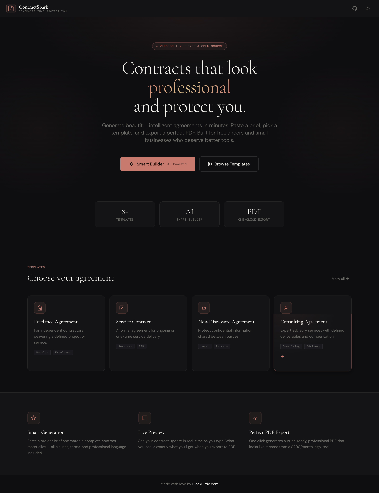
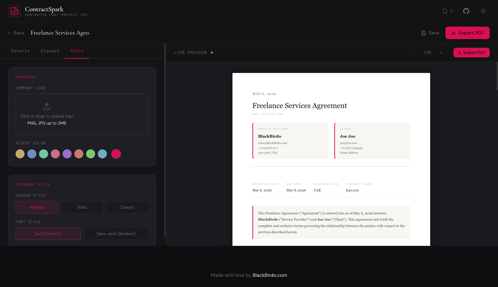

# ContractSpark ✦

**Beautiful Contracts That Protect You**

## ✨ Preview





*Beautiful, professional contracts generated with ContractSpark*

ContractSpark is a premium, open-source contract generator for freelancers and small businesses. Create professional legal agreements in minutes — powered by AI, exported as perfect PDFs.

---

## Features

- **8 Professional Templates** — Freelance Agreement, Service Contract, NDA, Consulting Agreement, Client Retainer, Partnership Agreement, Employment Offer, Website Design Contract
- **AI Smart Builder** — Paste a project brief and get a complete contract instantly (powered by Claude)
- **Live Preview** — Real-time document preview that mirrors your PDF exactly
- **Custom Branding** — Upload your logo, pick accent colors, choose document styles
- **Payment Milestones** — Visual payment schedule with percentage breakdowns
- **One-Click PDF Export** — Print-ready, professional A4 documents
- **Save & Load** — Store up to 20 contracts in browser localStorage
- **Dark / Light Mode** — Beautiful in both themes
- **100% Client-Side** — No backend, no account, no tracking

---

## Getting Started

### Option 1: Just Open It

```bash
# Clone the repo
git clone https://github.com/ICodingStack/ContractSpark.git
cd ContractSpark

# Open in browser (no build step required)
open index.html
```

### Option 2: Local Server

```bash
# Using Python
python3 -m http.server 8080

# Using Node.js
npx serve .

# Then visit
open http://localhost:8080
```

---

## AI Smart Builder Setup

ContractSpark uses the [Anthropic Claude API](https://anthropic.com) for AI-powered contract generation. Without an API key, it gracefully falls back to template-based generation.

To enable AI generation, the app calls `https://api.anthropic.com/v1/messages` directly from the browser. Note: for production use, you should proxy API calls through your own backend to protect your key.

---

## Project Structure

```
contractspark/
├── index.html              # Main app entry point
├── css/
│   └── style.css           # All styles (dark theme, preview, forms)
├── js/
│   ├── main.js             # Alpine.js app controller
│   ├── contract-data.js    # Templates, clauses, data structures
│   ├── smart-builder.js    # AI generation + local fallback
│   ├── preview-renderer.js # Live HTML preview rendering
│   ├── pdf-export.js       # jsPDF-based PDF generation
│   └── utils.js            # Shared helpers (dates, storage, colors)
├── assets/
│   └── icons/              # SVG icon assets
├── README.md
├── LICENSE
└── .gitignore
```

---

## Tech Stack

| Layer | Technology |
|-------|-----------|
| UI Framework | [Alpine.js](https://alpinejs.dev/) v3 |
| Styling | [Tailwind CSS](https://tailwindcss.com/) via CDN |
| PDF Generation | [jsPDF](https://github.com/parallax/jsPDF) + AutoTable |
| AI | [Anthropic Claude API](https://docs.anthropic.com/) |
| Storage | Browser localStorage |
| Fonts | Cormorant Garamond + DM Sans + DM Mono |

---

## Customization

### Adding a New Template

In `js/contract-data.js`, add a new entry to the `CONTRACT_TEMPLATES` array:

```javascript
{
  id: 'my-template',
  name: 'My Contract Type',
  description: 'What this contract is for.',
  tags: ['Tag1', 'Tag2'],
  icon: `<svg>...</svg>`,
  meta: { type: 'my-template', title: 'My Contract Agreement' },
  getClauses: (data) => [
    {
      id: 'clause-1',
      title: 'My Clause',
      enabled: true,
      content: `Clause content using ${data.partyA?.name} and ${data.scopeOfWork}...`
    },
    // more clauses...
  ]
}
```

### Changing Default Colors

Edit the `:root` CSS variables in `css/style.css`:

```css
:root {
  --accent: #c9a96e; /* Main gold accent */
}
```

---

## Browser Support

ContractSpark works in all modern browsers:
- Chrome / Edge 90+
- Firefox 88+
- Safari 14+
- Mobile Safari / Chrome for iOS/Android

---

## License

MIT License — free for personal and commercial use. See [LICENSE](./LICENSE).

---

## Contributing

Pull requests welcome! Please open an issue first to discuss major changes.

---

**Made with love ❤️ by [BlackBirdo](https://blackbirdo.com)**
